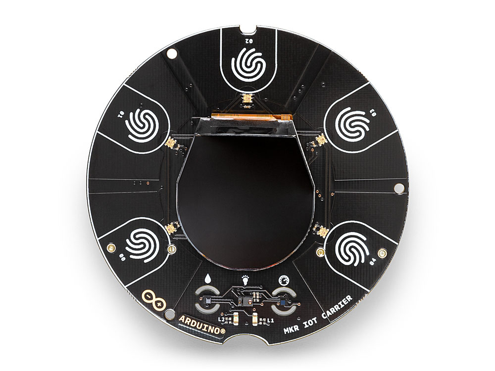
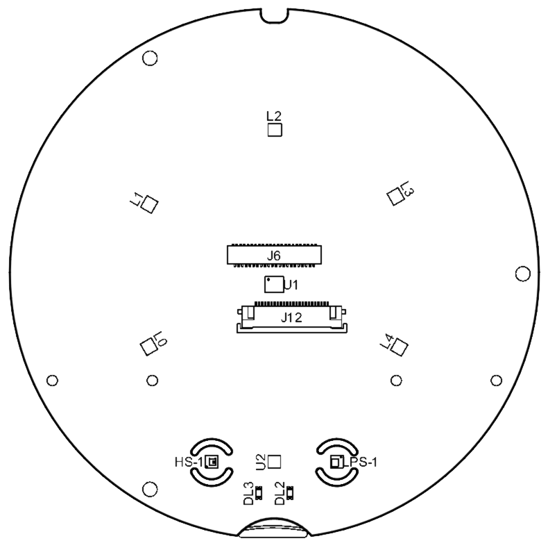
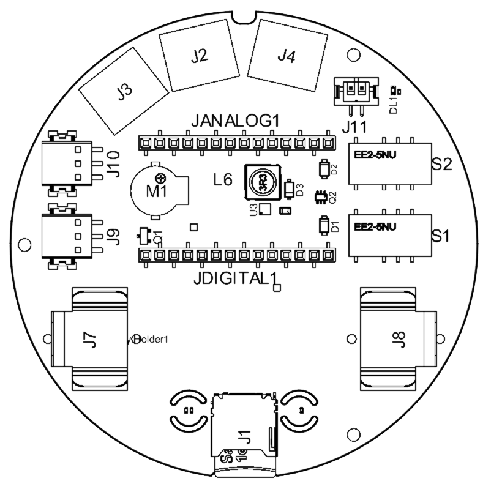
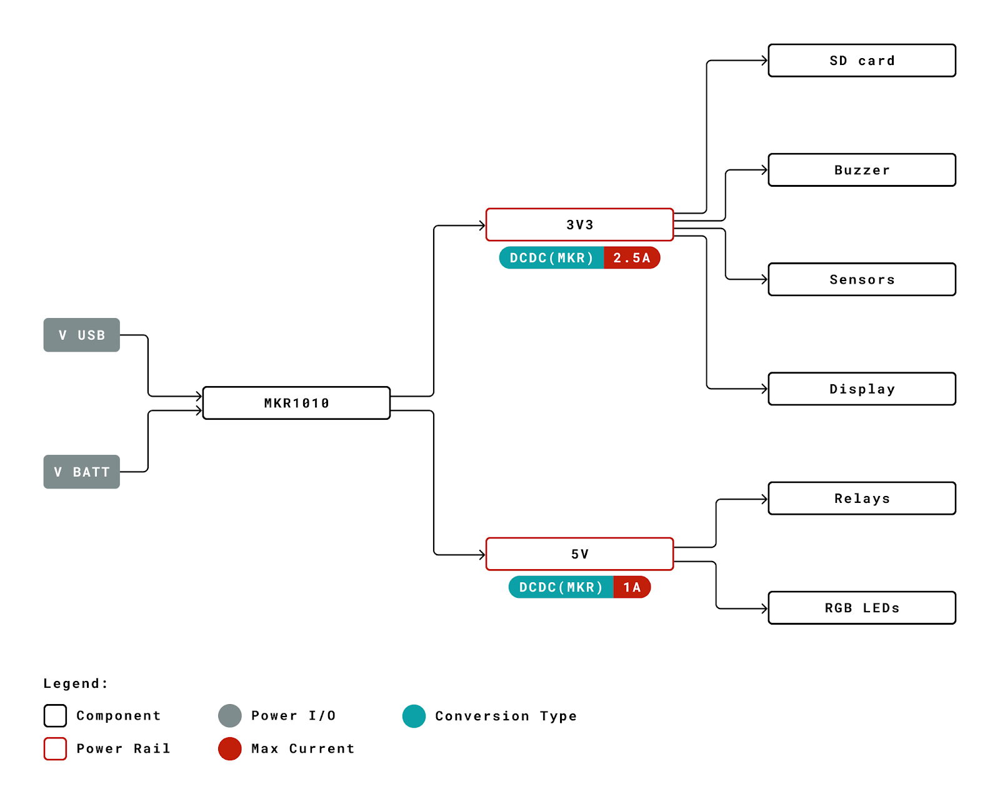
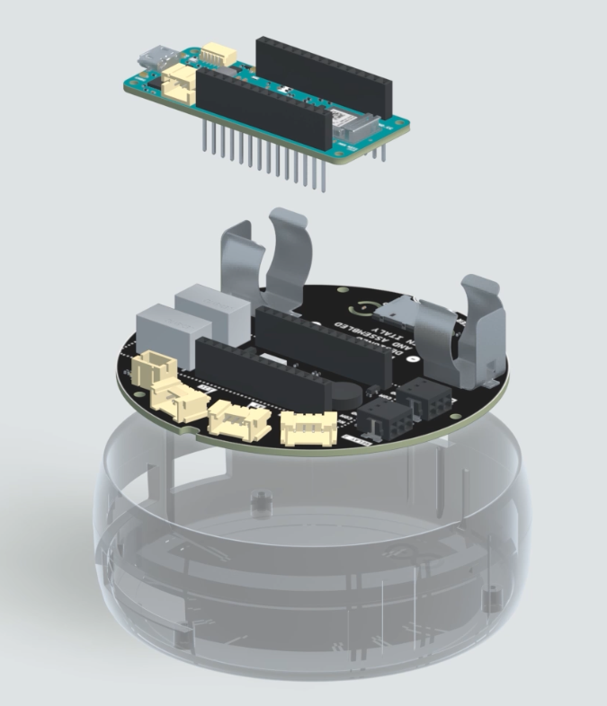
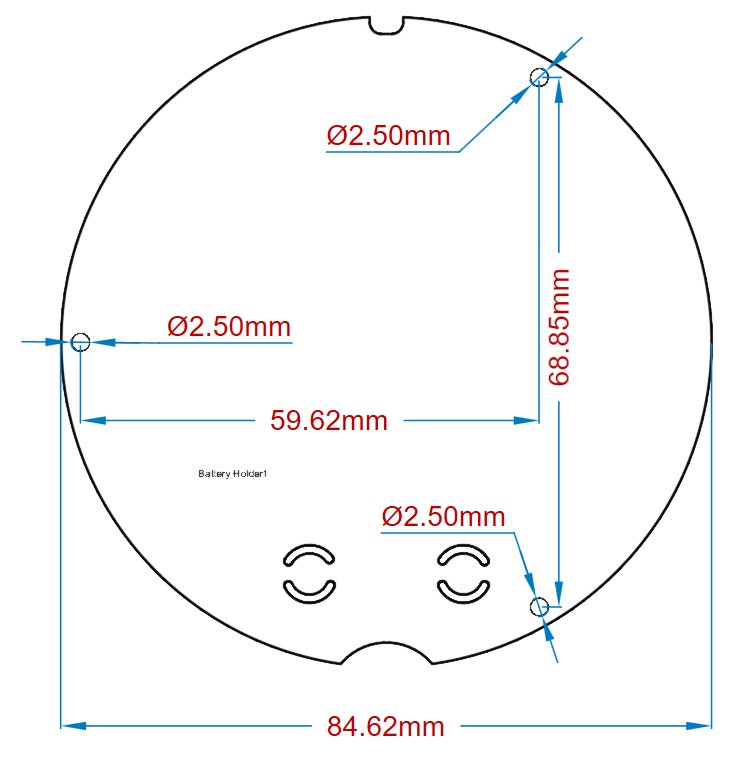

# Description 
The MKR IoT Carrier provides infinite possibilities for IoT projects. 

The integrated sensors, circuits and display leave you free to focus on programming and prototyping your ideas. 

# Target areas:
IoT applications, MKR hobbyists 

# Features

***Note: This board is passive and requires a MKR board to function.***

* **Grove Connectors**
    * Easy interface with wide range of Grove modules and sensors
    * 2x analog sensor input
    * 1x I2C interface 

* **ST LSM6DSOX 6-axis IMU Sensor**
    * 3-axis accelerometer 2/±4/±8/±16 g full scale
    * 3-axis gyroscope 125/±250/±500/±1000/±2000 dps (degrees per second)
    * I2C interface to Arduino MKR board
    * Low power consumption (0.55mA max) 

* **Rounded 1.3” TFT Display**
    * 240 x 240 resolution
    * 36 x 40 mm 

* **ST HTS221 Humidity Sensor**
    * Capacitive sensing 
    * 0-100% humidity sensing range
    * Humidity accuracy: ± 3.5% rH, 20 to +80% rH
    * Temperature accuracy: ± 0.5 °C,15 to +40 °C
    * I2C interface to Arduino MKR board
    * Low power consumption (2μA @ 1 Hz sampling rate)

* **Broadcom APDS-9660 RGB and Gesture Sensor**
    * Ambient light and RGB Colour Sensing
    * Proximity Sensing
    * Gesture Detection
    * UV/IR Blocking Filter
    * I2C interface to Arduino MKR board 

* **ST LPS22HBTR Pressure Sensor**
    * 260 to 1260 hPa (0.25 to 1.24 atm) absolute pressure range
    * I2C interface to Arduino MKR board 

* **Relays**
    * 2x KEMET EE2-5NU-L relays
    * 5V Coil voltage
    * 2A Current
    * 220V DC, 250V AC
    * Non-latching
    * Common, normally open and normally closed contacts
    * LED Status Indicator

* **Peripherals**
    * 5x Capacitive buttons
    * Buzzer
    * 5x Digital RGB LEDs
    * Rounded OLED 1,3” Display
    * 5x Capacitive qTouch buttons 

* **Memory**
    * Micro SD Card

* **Power**
    * Li-ion 18650 3.7 v battery holder
    * USB Battery charging via MKR Board (Runs up to 48h with a 3.7v 2500mAh)

* **I/O**
    * All sensors feature wake up function
    * 2x Analog Grove connectors
    * 1x I2C Grove connector
    * 2x relay connector

* **Safety information**
    * Class A 

# Contents

## The Board

### Application Examples

**Light controller:** Control your house lightning with the IoT Carrier, using the RGB light sensor. This feature identifies the general amount of light in a room or environment and adapts. If the board is connected to WiFi,  you can manage and control your device remotely on a smartphone via the IoT Cloud.

**Light and water controller for greenhouse:** With moisture sensor, pressure sensor and temperature the IoT Carrier can evaluate and recognize the moisture of the soil, depending on air humidity and sun. Through the various sensors, it can reconstruate suitable climate (e.g. tropical) with the help of heaters and relays to increase the humidity. It can also be programmed with a watering system thanks to the relays. 

**Weather station:** With temperature sensor, pressure sensor, humidity sensor and light sensors,  you can easily use your IoT carrier as a local weather station. The various sensors can via sensors collect statistics about the different variables required to display weather. 

### Accessories

* 18650 Li-ion battery
* Grove sensors 

### Related Products

* Arduino MKR 1010 (SKU: ABX00023)
* Protective case
* TFT Display

## Functional Overview

### Board Topology 

#### Front View

| **Ref.** | **Description**                        | **Ref.** | **Description**                    |
| -------- | -------------------------------------- | -------- | ---------------------------------- |
| U1       | LSM6DSOXTR 6-axis IMU IC               | U3       | LV52204MTTBG LED Boost Driver IC   |
| U2       | APDS-9660 RGB and Gesture Sensor IC    | HS-1     | HTS221 Humidity Sensor IC          |
| LPS-1    | LPS22HBTR Pressure Sensor IC           | L0-L4    | APA1022020-2018 RGB LED IC         |
| J6       | FH26W-45S-0.3SHW(60) Display Connector | J12      | SFV24R-1STBE1HLF Display Connector |

#### Back View

| **Ref.**  | **Description**                       | **Ref.** | **Description**                   |
| --------- | ------------------------------------- | -------- | --------------------------------- |
| J2, J3    | Analog Grove Connectors               | J4       | I2C Grove Connector               |
| J11       | B2B-PH-SM4-TB(LF)(SN) Power Connector | J9, J10  | 1771033 3-pin Relay Connector     |
| JDIGITAL1 | MKR Power and Digital Pin Connector   | JANALOG1 | MKR AREF and Analog Pin Connector |
| S1, S2    | EE2-5NU-L 2A 250V Mechanical Relay    | M1       | Buzzer                            |
| J1        | Micro SD Module                       | J7, J8   | Li-Ion 18650 Holder               |

### Power Tree

The Arduino MKR IoT Carrier makes use of the power management features of the Arduino MKR boards to power itself as well as to interface with the Li-Ion battery. 

### Solution Overview

The MKR IoT Carrier is also a part of the Oplá kit, that in addition to the IoT carrier contains an 

Arduino MKR WiFi 1010, a motion sensor, moisture sensor, USB cable and a protective case.  

## Board Operation

***Note: Please note that in order to operate with the Arduino MKR IoT Carrier, an Arduino MKR WiFi 1010 is required.***

### Getting Started - IDE 
If you want to program your Arduino MKR IoT carrier while offline you need to install the Arduino Desktop IDE **[1]**. To connect the Arduino IoT Carrier to your computer, you’ll need a Micro-B USB cable. This also provides power to the board, as indicated by the LED.

### Getting Started - Arduino Web Editor 
All Arduino boards, including this one, work out-of-the-box on the Arduino Web Editor **[2]**, by just installing a simple plugin.

The Arduino Web Editor is hosted online, therefore it will always be up-to-date with the latest features and support for all boards. Follow **[3]** to start coding on the browser and upload your sketches onto your board.

### Getting Started - Arduino IoT Cloud 
All Arduino IoT enabled products are supported on Arduino IoT Cloud which allows you to Log, graph and analyze sensor data, trigger events, and automate your home or business.

### Sample Sketches 
Sample sketches for the Arduino IoT carrier can be found either in the “Examples” menu in the Arduino IDE or in the “Documentation” section of the Arduino Pro website **[4]**

### Online Resources

Now that you have gone through the basics of what you can do with the board you can explore the endless possibilities it provides by checking exciting projects on ProjectHub **[5]**, the Arduino Library Reference **[6]** and the online store **[7]** where you will be able to complement your board with sensors, actuators and more

### Board Recovery 
All Arduino boards have a built-in bootloader which allows flashing the board via USB. In case a sketch locks up the processor and the board is not reachable anymore via USB it is possible to enter bootloader mode by double-tapping the reset button right after power up.

## Connector Pinouts

Detailed information on the IoT Carrier’s pinouts are available in a separate document: [Docs Arduino - MKR IoT Carrier pinout](https://docs.arduino.cc/resources/pinouts/ABX00047-full-pinout.pdf)

### Battery Clips

| Pin  | **Function** | **Type** | **Description**                 |
| :--: | :----------: | :------: | :------------------------------ |
|  1   |     GND      |  Power   | Ground                          |
|  2   |     VBAT     |  Power   | Positive 18650 Battery Terminal |

### A5

| Pin  | **Function** | **Type** | **Description**  |
| :--: | :----------: | :------: | ---------------- |
|  1   |     AN5      |  Analog  | Analog Input 5   |
|  2   |      NC      |    NC    | Not Connected    |
|  3   |     +5V      |  Power   | +5.0V power rail |
|  4   |     GND      |  Power   | Ground           |

### A6

| Pin  | **Function** | **Type** | **Description**  |
| :--: | :----------: | :------: | ---------------- |
|  1   |     AN6      |  Analog  | Analog Input 6   |
|  2   |      NC      |    NC    | Not Connected    |
|  3   |     +5V      |  Power   | +5.0V power rail |
|  4   |     GND      |  Power   | Ground           |

### I2C

| Pin  | **Function** | **Type** | **Description**  |
| :--: | :----------: | :------: | ---------------- |
|  1   |     SCL      | Digital  | I2C Clock Signal |
|  2   |     SDA      | Digital  | I2C Data Signal  |
|  3   |     +5V      |  Power   | +5.0V power rail |
|  4   |     GND      |  Power   | Ground           |

### Relay 1 / Relay 2

| Pin  | **Function** | **Type** | **Description** |
| :--: | :----------: | :------: | --------------- |
|  1   |      NC      |  Switch  | Normally Closed |
|  2   |     COM      |  Switch  | Common          |
|  3   |      NO      |  Switch  | Normally Open   |

## Mechanical Information

### Board Outline / Mounting Holes

## Ratings

### Absolute Maximum Ratings

| Symbol               | Description                              | Min  | Typ  | Max  | Unit |
| -------------------- | ---------------------------------------- | :--: | :--: | :--: | :--: |
| TMax      | Maximum thermal limit1        | -30  |  20  |  85  |  °C  |
| VBattMax  | Maximum input voltage from battery input | 3.2  | 3.7  | 4.3  |  V   |
| ARelayMax | Maximum current through relay switch     |  -   |  -   |  2   |  A   |
| PMax      | Maximum Power Consumption                |  -   |  -   | 5000 |  mW  |

## Certifications

### Declaration of Conformity CE DoC (EU)

We declare under our sole responsibility that the products above are in conformity with the essential requirements of the following EU Directives and therefore qualify for free movement within markets comprising the European Union (EU) and European Economic Area (EEA). 

### Declaration of Conformity to EU RoHS & REACH 211 01/19/2021

Arduino boards are in compliance with RoHS 2 Directive 2011/65/EU of the European Parliament and RoHS 3 Directive 2015/863/EU of the Council of 4 June 2015 on the restriction of the use of certain hazardous substances in electrical and electronic equipment. 

| **Substance**                          | **Maximum Limit (ppm)** |
| -------------------------------------- | ----------------------- |
| Lead (Pb)                              | 1000                    |
| Cadmium (Cd)                           | 100                     |
| Mercury (Hg)                           | 1000                    |
| Hexavalent Chromium (Cr6+)             | 1000                    |
| Poly Brominated Biphenyls (PBB)        | 1000                    |
| Poly Brominated Diphenyl ethers (PBDE) | 1000                    |
| Bis(2-Ethylhexyl} phthalate (DEHP)     | 1000                    |
| Benzyl butyl phthalate (BBP)           | 1000                    |
| Dibutyl phthalate (DBP)                | 1000                    |
| Diisobutyl phthalate (DIBP)            | 1000                    |

Exemptions : No exemptions are claimed. 

Arduino Boards are fully compliant with the related requirements of European Union Regulation (EC) 1907 /2006 concerning the Registration, Evaluation, Authorization and Restriction of Chemicals (REACH). We declare none of the SVHCs (https://echa.europa.eu/web/guest/candidate-list-table), the Candidate List of Substances of Very High Concern for authorization currently released by ECHA, is present in all products (and also package) in quantities totaling in a concentration equal or above 0.1%. To the best of our knowledge, we also declare that our products do not contain any of the substances listed on the "Authorization List" (Annex XIV of the REACH regulations) and Substances of Very High Concern (SVHC) in any significant amounts as specified by the Annex XVII of Candidate list published by ECHA (European Chemical Agency) 1907 /2006/EC.

### Conflict Minerals Declaration 

As a global supplier of electronic and electrical components, Arduino is aware of our obligations with regards to laws and regulations regarding Conflict Minerals, specifically the Dodd-Frank Wall Street Reform and Consumer Protection Act, Section 1502. Arduino does not directly source or process conflict minerals such as Tin, Tantalum, Tungsten, or Gold. Conflict minerals are contained in our products in the form of solder, or as a component in metal alloys. As part of our reasonable due diligence Arduino has contacted component suppliers within our supply chain to verify their continued compliance with the regulations. Based on the information received thus far we declare that our products contain Conflict Minerals sourced from conflict-free areas. 

## FCC Caution

Any Changes or modifications not expressly approved by the party responsible for compliance could void the user’s authority to operate the equipment.

This device complies with part 15 of the FCC Rules. Operation is subject to the following two conditions: 

(1) This device may not cause harmful interference

(2) this device must accept any interference received, including interference that may cause undesired operation.

**FCC RF Radiation Exposure Statement:**

1. This Transmitter must not be co-located or operating in conjunction with any other antenna or transmitter.

2. This equipment complies with RF radiation exposure limits set forth for an uncontrolled environment.

3. This equipment should be installed and operated with minimum distance 20cm between the radiator & your body.

**English**: 
User manuals for licence-exempt radio apparatus shall contain the following or equivalent notice in a conspicuous location in the user manual or alternatively on the device or both. This device complies with Industry Canada licence-exempt RSS standard(s). Operation is subject to the following two conditions:

(1) this device may not cause interference

(2) this device must accept any interference, including interference that may cause undesired operation of the device.

**French**: 
Le présent appareil est conforme aux CNR d’Industrie Canada applicables aux appareils radio exempts de licence. L’exploitation est autorisée aux deux conditions suivantes :

(1) l’ appareil nedoit pas produire de brouillage

(2) l’utilisateur de l’appareil doit accepter tout brouillage radioélectrique subi, même si le brouillage est susceptible d’en compromettre le fonctionnement.

**IC SAR Warning:**

**English** 
This equipment should be installed and operated with minimum distance 20 cm between the radiator and your body.  

**French**: 
Lors de l’ installation et de l’ exploitation de ce dispositif, la distance entre le radiateur et le corps est d ’au moins 20 cm.

**Important:** The operating temperature of the EUT can’t exceed 85℃ and shouldn’t be lower than -40℃.

Hereby, Arduino S.r.l. declares that this product is in compliance with essential requirements and other relevant provisions of Directive 2014/53/EU. This product is allowed to be used in all EU member states. 

| Frequency bands | Maximum output power (ERP) |
| :-------------: | :------------------------: |
|   863-870Mhz    |          -3.22dBm          |

## Company Information

| Company name    | Arduino S.r.l.                             |
| --------------- | ------------------------------------------ |
| Company Address | Via Andrea Appiani,25 20900 MONZA (Italy） |

## Reference Documentation

| **Ref**                   | **Link**                                                     |
| ------------------------- | ------------------------------------------------------------ |
| Arduino IDE (Desktop)     | https://www.arduino.cc/en/Main/Software                      |
| Arduino IDE (Cloud)       | https://create.arduino.cc/editor                             |
| Cloud IDE Getting Started | https://create.arduino.cc/projecthub/Arduino_Genuino/getting-started-with-arduino-web-editor-4b3e4a |
| Project Hub               | https://create.arduino.cc/projecthub?by=part&part_id=11332&sort=trending |
| Library Reference         | https://www.arduino.cc/reference/en/libraries/arduino_mkriotcarrier/ |
| Online Store              | https://store.arduino.cc/mkr-iot-carrier                     |

## Revision History

| **Date**   | **Revision** | **Changes**   |
| ---------- | ------------ | ------------- |
| 02/24/2021 | 1            | First Release |
